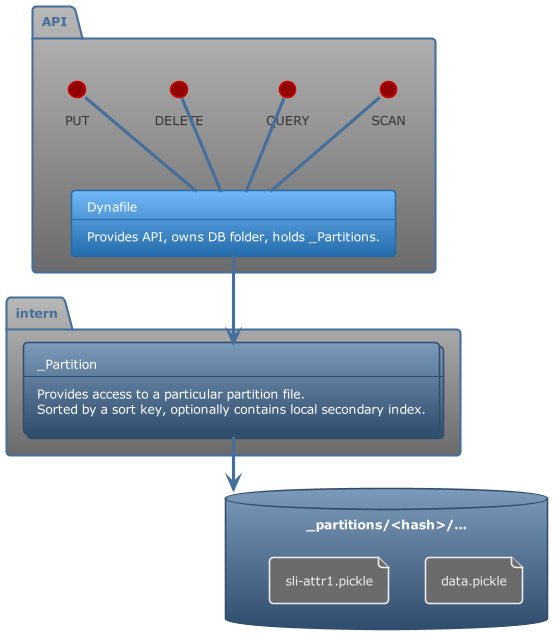

> Consider the project of a proof of concept! Definitely not production ready!

# Dynafile

Embedded pure Python NoSQL database following DynamoDB concepts.

```bash

pip install dynafile

# with string filter support using filtration

pip install "dynafile[filter]"

# bloody edge

pip install git+https://github.com/eruvanos/dynafile.git
pip install filtration

```

## Overview

Dynafile stores items within partitions, which are stored as separate files. Each partition contains a SortedDict
from `sortedcontainers` which are sorted by the sort key attribute.

Dynafile does not implement the interface or functionality of DynamoDB, but provides familiar API patterns.

Differences:

- Embedded, file based
- No pagination

## Features

- persistence
- put item
- get item
- delete item
- scan - without parameters
- query - starts_with
- query - index direction
- query - filter
- scan - filter
- batch write

## Roadmap

- atomic file write
- event stream hooks
- GSI - global secondary index
- update item
- batch get
- thread safeness
- LSI - local secondary index
- split partitions
- parallel scans - pre defined scan segments
- transactions
- optimise disc load time (cache partitions in memory, invalidate on file change)
- conditional put item
- TTL

## API

```python
from dynafile import *

db = Dynafile(path=".", pk_attribute="PK", sk_attribute="SK")

# put items
db.put_item(item={"PK": "user#1", "SK": "user#1", "name": "Bob"})
db.put_item(item={"PK": "user#1", "SK": "role#1", "TYPE": "sender"})
db.put_item(item={"PK": "user#2", "SK": "user#2", "name": "Alice"})

# more performant batch operation
with db.batch_writer() as writer:
    db.put_item(item={"PK": "user#3", "SK": "user#3", "name": "Steve"})
    db.delete_item(key={"PK": "user#3", "SK": "user#3"})

# retrieve items
item = db.get_item(key={
    "PK": "user#1",
    "SK": "user#1"
})

# query item collection by pk
items = list(db.query(pk="user#1"))

# scan full table
items = list(db.scan())

```

### Filter

`query` and `scan` support filter, you can provide callables as filter like lambda expressions.

Another option are [filtration](https://pypi.org/project/filtration/) expressions.

* Equal ("==")
* Not equal ("!=")
* Less than ("<")
* Less than or equal ("<=")
* Greater than (">")
* Greater than or equal (">=")
* Contains ("in")
    * RHS must be a list or a Subnet
* Regular expression ("=~")
    * RHS must be a regex token

Examples:

* `SK =~ /^a/` - SK starts with a
* `SK == 1` - SK is equal 1
* `SK == 1` - SK is equal 1
* `nested.a == 1` - accesses nested structure `item.nested.a`

## Architecture



### File Structure

```text

--- ROOT ---
./db/

--- MAIN DB ---

|- meta.json - meta information
|- _partitions/
    |- <hash>/
        |- data.pickle - Contains partition data by sort key (SortedDict)
        |- lsi-attr1.pickle - Contains partition data by lsi attr (SortedDict)

--- GSI ---
|- _gsi-<gsi-name>/
    |- _partitions/
        |- <hash>/
            |- data.pickle - Contains partition data by sort key (SortedDict)

```